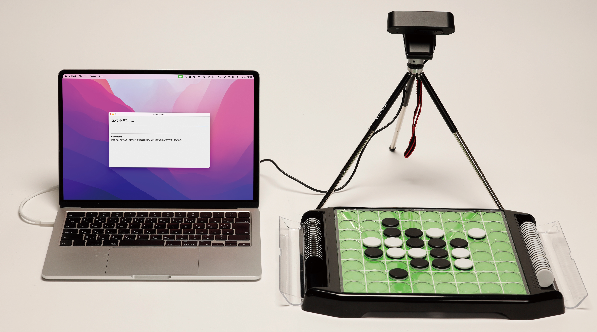

# Real-time Othello Commentator

<p align="center">
  
</p>

実物のオセロ盤を USB カメラで認識し、着手のたびに大規模言語モデルが実況コメントを生成・音声再生するシステムです。

このプロジェクトでは、AI を解説者やアドバイザーではなく、「隣から口を挟んでくる友人のようなムードメーカー」として設計しています。局面理解を助けるのではなく、オセロで遊んでいるときの雰囲気やプレイヤー同士のコミュニケーションを促すことを目指しました。

## Overview

従来の LLM を用いた実況・支援システムは、観戦体験の情報拡張や理解促進、負担軽減などの「支援」を主目的とすることが多くありました。本研究ではその方向性とは異なり、AI をゲーム空間に介入する第三者として位置づけ、プレイヤー同士の関係性や場の空気に働きかける実況体験を探っています。

提案システムは、USB カメラ映像から盤面状態をリアルタイムに認識し、着手イベントを検出すると LLM にプロンプトを送信し、生成されたコメントを GUI 上に表示しつつ音声として再生します。コメント生成では、通常手・パス・終局などのイベント種別や局面段階を考慮しながら、感情的な実況を返すことを狙っています。

## Features

- 実物のオセロ盤を対象にしたリアルタイム実況
- USB カメラによる実物オセロ盤のリアルタイム認識
- キャリブレーションと透視変換による盤面位置の正規化
- 色成分と明度分布に基づく石分類
- 肌色抽出を利用した手検出
- 手の出入りと石総数の変化を組み合わせた着手イベント検出
- 合法手や評価値を内部参照しつつ、数値を直接言及しないように指示したプロンプトに基づく実況コメント生成
- GUI 表示と音声読み上げによるリアルタイム実況体験
- 標準プロバイダとして Ollama 経由の GPT-OSS 120B Cloud を利用
- OpenAI API、Gemini API、ローカル Gemma など複数プロバイダ対応を拡張中

## System Flow

1. USB カメラから盤面映像を取得する
2. キャリブレーションによって盤面領域を確定する
3. 透視変換後の盤面画像から石配置を推定する
4. 手検出と石数変化を使って着手イベントを判定する
5. 現在局面・合法手・評価情報をもとに LLM 用プロンプトを構築する
6. 生成された実況コメントを GUI に表示し、必要に応じて音声再生する

## Research Context

このシステムは、卒業研究「盤面画像解析と大規模言語モデルを用いたリアルタイムオセロ実況」の実装プロトタイプです。

デザイン上の主眼は、AI をコーチや解説者としてではなく、アナログゲームの場における雰囲気形成や会話促進に寄与する存在として設計することにあります。デザイン探索では、実況 AI の介入が感情面・思考面・コミュニケーション面に変化をもたらす可能性が示唆されました。

## Demo

<p align="center">
  <a href="https://youtu.be/OTV0zdRY-eQ">
    
  </a>
</p>

## Documentation Status

現在は、盤面認識、LLM によるコメント生成、GUI 表示、音声読み上げといった中核機能を中心に掲載しています。UI は公開に向けて見やすさと操作導線を整理している段階であり、今後 README に起動後の操作方法、キャリブレーション手順、実況開始までの流れを追記する予定です。

## Project Structure

現在のコードベースは、責務ごとにパッケージを分けた構成に整理しています。エントリポイントは [main.py](./main.py) に残しつつ、実装本体は [othello_commentator](./othello_commentator) 配下にまとめています。

- [main.py](./main.py): アプリ起動エントリポイント。GUI を立ち上げ、盤面認識用の子プロセスを起動します
- [othello_commentator/app](./othello_commentator/app): アプリ全体の組み立て、IPC、セッション状態、再開制御、メッセージ振り分け
- [othello_commentator/realtime](./othello_commentator/realtime): カメラ入力、盤面追跡、キャリブレーション、リアルタイム制御用の子プロセス
- [othello_commentator/ui](./othello_commentator/ui): Tkinter ベースの操作画面、ステータス画面、盤面表示ウィジェット
- [othello_commentator/llm](./othello_commentator/llm): LLM プロバイダ初期化、コメント生成、応答パース
- [othello_commentator/audio](./othello_commentator/audio): 音声読み上げラッパー
- [othello_commentator/domain](./othello_commentator/domain): オセロルール、盤面変換、座標処理などのドメインロジック
- [othello_commentator/storage](./othello_commentator/storage): ログ保存、成果物パス、コメント集計出力
- [devtools](./devtools): 盤面表示やリアルタイム状態確認のための補助ツール
- [tests](./tests): 単体テスト

とくに主要な実装の起点は次のファイルです。

- [othello_commentator/app/bootstrap.py](./othello_commentator/app/bootstrap.py): GUI、状態、LLM、IPC の組み立て
- [othello_commentator/realtime/engine.py](./othello_commentator/realtime/engine.py): 盤面認識とイベント検出の中核ループ
- [othello_commentator/realtime/runner.py](./othello_commentator/realtime/runner.py): 子プロセス用エントリポイント
- [othello_commentator/llm/provider_registry.py](./othello_commentator/llm/provider_registry.py): 利用可能な LLM プロバイダの初期化
- [othello_commentator/ui/control_window.py](./othello_commentator/ui/control_window.py): メイン操作画面

## Environment

動作確認済みの環境:

- macOS
- Python 3.10 以上

Windows や Linux ではまだ十分に検証していません。カメラ制御、OpenCV のウィンドウ表示、音声読み上げなどは OS やデバイスによって調整が必要になる可能性があります。

## Hardware Requirements

このシステムを実際に動かすには、以下のハードウェアを想定しています。

- USB カメラ
- 実物のオセロ盤

## Dependencies

標準セットアップでは、主に以下のライブラリを使用します。

- OpenCV / NumPy
- Pillow
- `python-dotenv`
- `ollama`

`ollama` は、実況コメント生成に使用する GPT-OSS 120B Cloud への接続に利用します。

次のプロバイダ関連コードも残していますが、公開時点では標準プロバイダではありません。

- OpenAI API
- Google Gemini API
- Local Gemma

一部機能は環境依存です。

- 音声読み上げは macOS の `say` コマンドを優先して使用します
- カメラ設定や露出制御は環境差の影響を受けます

ローカル Gemma 実行用のコードも残していますが、標準セットアップには含めていません。利用する場合は PyTorch や Transformers などの追加依存が必要で、現状の設定には Apple Silicon の `mps` を前提にした部分があります。

## LLM Provider

公開時点では、Ollama 経由の GPT-OSS 120B Cloud を標準プロバイダとして想定しています。

このプロジェクトでは、盤面認識後に生成したプロンプトを LLM に送信し、返ってきたコメントを GUI 表示と音声読み上げに利用します。現在の公開版では、Ollama Python client を通じて GPT-OSS 120B Cloud にリクエストを送る構成を標準経路としています。

- 標準: GPT-OSS 120B Cloud via Ollama
- 整備中: OpenAI API / ChatGPT
- 整備中: Gemini API
- 実験的: Local Gemma

OpenAI API、Gemini API、ローカル Gemma の接続実装はコード上に残していますが、公開時点ではプロンプト構成、エラー処理、依存関係の整理が完了していません。これらのプロバイダは今後の改善項目として扱っています。

## Setup

標準セットアップは以下の流れです。

```bash
python3 -m venv .venv
source .venv/bin/activate
pip install -r requirements.txt
cp .env.example .env
```

公開時点の標準プロバイダを利用するには、Ollama 側で GPT-OSS 120B Cloud へアクセスできる状態にしておく必要があります。

`.env` は OpenAI API や Gemini API を試す場合に使用します。公開時点の標準プロバイダである GPT-OSS 120B Cloud via Ollama では、`.env` の API key は必須ではありません。

```env
OPENAI_API_KEY=
GOOGLE_API_KEY=
```

必要に応じて、次の確認も行ってください。

- `ollama list` で `gpt-oss:120b-cloud` が利用可能であることを確認する
- macOS では Python / Terminal にカメラ権限を付与する
- 初回起動時は OpenCV のキャリブレーション用ウィンドウが前面に出ない場合があるため、他のウィンドウの背後も確認する

## Run

```bash
python3 main.py
```

起動すると Tkinter のメイン GUI と、盤面認識用の子プロセスが立ち上がります。初回はキャリブレーション用の OpenCV ウィンドウで盤面静止画の確定と四隅選択を行い、その後 GUI から開始操作や再開操作、キャリブレーションのやり直しを行います。

## Testing

現時点では、リアルタイム処理の一部に対する単体テストを追加しています。

```bash
python3 -m pytest
```

テスト対象やカバレッジは今後拡充予定です。

## Current Limitations

- コードベースはまだ整理途中で、ファイル構成を継続的に改善しています
- 一部設定値がコード中に直接記述されています
- カメラ、照明、盤面状態によって認識精度が変動します
- LLM 応答の遅延が実況タイミングに影響する場合があります
- 一部機能は macOS 前提で、他 OS での移植性は未整備です
- OpenAI API、Gemini API、ローカル Gemma は接続実装を残していますが、公開時点では整備中です

## Future Work

- コード分割と責務整理の継続
- 設定値の外部化と移植性改善
- テストケースの追加
- OpenAI API / Gemini API / Local Gemma のプロンプト構成とエラー処理の整理
- Gemini SDK の `google.genai` への移行
- ドキュメント、セットアップ手順、デモ素材の強化
- 実験結果や設計意図の整理

## References

本プロジェクトのオセロ評価では、各マスに重みを与える評価方法を以下の資料を参考に実装しています。

- にゃにゃん(山名琢翔), 「オセロAIの教科書 3 〖基礎〗 1手読みAIを作る」  
  https://note.com/nyanyan_cubetech/n/n17c169271832
- Nyanyan/OthelloAI_Textbook, `cell_evaluation.hpp`  
  https://github.com/Nyanyan/OthelloAI_Textbook/blob/main/cell_evaluation.hpp

参照元リポジトリは MIT License で配布されています。

## License

本プロジェクトは MIT License で公開しています。詳細は [LICENSE](./LICENSE) を参照してください。
